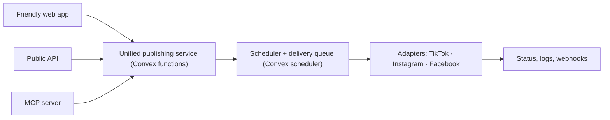

# PRD — Post Social

**A publishing control plane for people, products, and AI agents.**

| | |
|---|---|
| **Owner** | Aki Bajulaiye — Pentridge Media |
| **Status** | Draft v1 — approval-first build |
| **Last updated** | 2026-07-21 |
| **Backend** | Convex (database, functions, scheduling, file storage, realtime) |
| **v1 platforms** | TikTok (Direct Post) · Instagram (Business) · Facebook Pages |
| **Next platforms** | YouTube Shorts → Threads → (LinkedIn, GBP, Bluesky, …) |

---

## 1. Summary

Post Social lets businesses, creators, and AI agents connect their social accounts once and publish across networks from one calm, reliable place — through a friendly web app, a public API, or an MCP server. All three routes share the same accounts, media, publishing engine, scheduler, and delivery history.

The strategic asset is **direct, approved platform API access**. Pentridge Media holds one approved developer app per platform; end users connect their own accounts via OAuth 2.0, and the app posts on their behalf under their own rate limits. That means platform cost stays effectively $0 as users scale — the moat most builders skip by paying per-account aggregators ($168/mo at 50 accounts, ~$900/mo at 100 on some platforms).

**Positioning:** the infrastructure of Zernio with the warmth of Post Bridge. API/MCP-first, but human-friendly in language and experience. Not another Buffer-style dashboard.

**Product-family naming:** **Thought Social** is the mobile content-creation product. **Post Social** is this web publishing product. They should feel related, but not identical: Thought Social is the expressive creation companion; Post Social is the precise publishing control surface.

This document defines two milestones — an **Approval MVP** (what we build, demo, and submit to TikTok and Meta) and a **Market MVP** (the features that deliver the positioning) — plus the Convex architecture, design direction, testing matrices, and demo scripts required to pass review.

---

## 2. Goals & non-goals

### Goals
1. Ship the smallest product that reads as a legitimate, multi-user publishing platform and passes **TikTok Content Posting API audit** and **Meta App Review** for Instagram + Facebook Pages.
2. Build one publishing engine with **three equivalent entry points** (UI, API, MCP) from day one — the UI is a client of the same service, not a separate product.
3. Support **flexible agent/API approval policy** per workspace and per connected account: confirm-each-publish, approve-after-draft, or fully autonomous.
4. Store tokens securely (OAuth only, encrypted at rest, server-side, auto-refreshing) with a clean disconnect/deletion story for the privacy policy.
5. Produce annotated, per-platform demo videos and all submission assets.

### Non-goals (v1)
- **Billing / subscriptions** — architected for later, not built before submission.
- **Analytics, comments, DMs, inbox** — do not request scopes for unbuilt features (the #1 rejection cause).
- **Threads, YouTube, LinkedIn, GBP, Bluesky, X** — deferred; see §11 rollout.
- **Full campaign management** — Calendar is a simple schedule view, not a planning suite.
- **A throwaway test integration (e.g. Bluesky harness)** — TikTok Sandbox and Meta dev mode are fully functional dev environments for the platforms actually shipping.

---

## 3. Users & positioning

**Primary customer: creators, solopreneurs, and small businesses.** They want to create once, keep a consistent presence across networks, and avoid the complexity of separate publishing tools. Language, onboarding, and the first demo speak directly to an individual building something of their own. Automation consultants remain a secondary developer audience for the later API/MCP surface.

**Three equivalent users of one engine:**
- **A person** publishes from the web composer.
- **An application** publishes through the API.
- **An AI agent** prepares and manages posts through MCP.

### Voice & language
Calm rather than technical. Confident rather than hyped. Explicit about what will happen. Friendly without being playful or vague.

| Say | Not |
|---|---|
| "Connect account" | "Configure OAuth provider" |
| "Your post is ready" | "Job completed" |
| "Instagram needs a little attention" | "Container processing failed" |

Technical terminology lives in the Developers area, API logs, and expandable error details — never on the primary surfaces.

---

## 4. Architecture: one engine, three entry points



**Principles**
- The MCP server and API are **thin adapters** over the same Convex application service the UI calls. No independent publishing implementations.
- Platform integrations are **isolated modules** with their own scopes, failure modes, and rate limits. One unstable integration must not degrade the others. Do not hide them behind a single generic client.
- The API models **platform-specific options explicitly** rather than pretending every platform behaves identically.

### Why Convex
One backend covers database, functions, cron/scheduling, file storage, realtime subscriptions, and end-to-end type safety — matching every responsibility below without stitching services together.

| Responsibility | Convex primitive |
|---|---|
| Post / destination / result data | Documents + relations |
| Publish queue & scheduled sends | Scheduled functions / cron |
| Token refresh (TikTok 24h) | Scheduled functions |
| Media library | File storage |
| Live status in the UI | Realtime queries |
| Encrypted token storage | Server-side action env + encryption (never in client) |

---

## 5. Data model (core entities)

- **Workspace** — the private account boundary for a creator or small business. Holds members, default approval policy, and later API keys.
- **User** — a member of a workspace.
- **ConnectedAccount** — one OAuth connection: platform, external account id, handle, avatar, scopes, encrypted access + refresh tokens, expiry, health status, per-account approval policy override.
- **MediaAsset** — uploaded file in Convex storage; reusable across posts.
- **Post** — the unit of intent: shared caption + media + author + workspace + status. A post fans out to one or more destinations.
- **Destination** — one Post targeted at one ConnectedAccount, with platform-specific options (privacy level, interaction toggles, disclosure flags, title, etc.) and its own status + result.
- **Approval** — who approved a post/destination for publishing, when, via which entry point, under which policy. Immutable.
- **PublishJob** — a queued/executing send for a destination: request id, processing events, final status, live URL, sanitized error.
- **AuditEvent** — append-only record for every publish attempt (see §9).
- **ApiKey / WebhookEndpoint** — developer surface (Market MVP).

### Approval policy (the flexible model)
Every publish resolves an **effective policy** = account override ⟶ workspace default. Three modes:

| Mode | Agent/API can… | Publish requires… |
|---|---|---|
| **Confirm each** | draft, upload, select accounts, propose schedule | a human to approve each publish via a review card |
| **Approve after draft** | same | one human approval of the draft, then it publishes on schedule |
| **Autonomous** | everything | nothing — publishes directly under stored policy |

The **Approval MVP demos "Confirm each"** for TikTok/Meta reviewers (safest posture, cleanest audit trail). The other two modes exist in the model and settings but are the Market-MVP story for automation buyers.

---

## 6. Product surface (6 screens)

Intentionally small. Ordinary users get the Post Bridge experience; the product stays visibly infrastructure-first.

1. **Home** — quiet overview: upcoming posts, recent results, connected-account health, prominent **Create a post**.
2. **Create** — upload media, write shared copy, choose destinations, optionally customize per platform, publish now or schedule.
3. **Calendar** — scheduled content in a simple calendar/list. Not a campaign suite.
4. **Accounts** — separate OAuth connections for TikTok, Instagram, and Facebook Pages; account health, reconnect + disconnect. Instagram Login accepts a professional Business or Creator account without requiring a linked Facebook Page. Facebook Page Login independently filters to Pages where the user can create content.
5. **Activity** — one record per post with a result per destination: scheduled / processing / published / failed, plus the live-post link and sanitized error detail.
6. **Developers** — API keys, MCP connection instructions, webhooks, usage, concise examples. *(Market MVP)*

Plus the non-negotiable public pages: **Landing**, **Terms of Service**, **Privacy Policy**, **Auth**.

---

## 7. The composer (build to TikTok's spec)

The composer decides approval or rejection. **Build to TikTok's rules and Meta/YouTube come free.** All per-platform options render dynamically from what each platform's API returns — never hardcoded.

### 7.1 TikTok — mandatory composer UX
Call `/v2/post/publish/creator_info/query/` when the composer renders, then honor **all** of:

| Rule | Detail |
|---|---|
| Creator identity | Show the creator's nickname so the user knows which account receives the post. |
| Privacy selector | **No default value.** Populate from `privacy_level_options`. Never hardcode the four levels — a private account has no `PUBLIC_TO_EVERYONE`; hardcoding gets rejected. |
| Interaction toggles | Comment / Duet / Stitch **unchecked by default**. Availability is a property of the account. If disabled in the creator's settings, render greyed out with a tooltip explaining why. |
| Content disclosure | Off by default. When enabled, reveal "Your brand" and "Branded content" checkboxes. |
| Music usage | Display: "By posting, you agree to TikTok's Music Usage Confirmation." |
| Video duration | Validate against `max_video_post_duration_sec` from `creator_info`. |
| Posting capacity | If `creator_info` says the creator can't post now, halt and prompt to retry later. |
| Editable preset text | Any pre-filled caption/hashtags must be user-editable before posting. |
| Explicit consent | Only transmit content to TikTok after the user actively confirms. |

**Publish flow:** `creator_info/query` → `video/init` (FILE_UPLOAD or PULL_FROM_URL) → chunked upload → poll `status/fetch` until `PUBLISH_COMPLETE`. Photos use `content/init` with `post_mode` + `media_type`. Base URL `open.tiktokapis.com`.

**Scopes (v1):** `video.publish` (Direct Post) + `user.info.basic`. Note: base app review only grants inbox upload; **direct public posting requires the separate Content Posting API audit**. Until it passes, every direct post is forced to `SELF_ONLY` — expected in sandbox, not a bug.

**Limits:** 6 init/min, 30 status-checks/min, ~15 posts/day per creator (shared across all clients), video ≤1 GB MP4/H.264, caption ~2,200 chars, access token 24h (refresh via `grant_type=refresh_token`).

### 7.2 Instagram + Facebook Pages
**Scopes (v1) — request ONLY these:** `instagram_business_basic` + `instagram_business_content_publish`. No analytics/comments/DMs. (The older `instagram_basic`/`instagram_content_publish` were deprecated Jan 27 2025.)

**Instagram prerequisite:** Instagram Login requires an **Instagram professional Business or Creator account**. It does **not** require a linked Facebook Page. Personal Instagram accounts must be rejected with a helpful explanation. Facebook Pages connect through their own Facebook Login flow and require Page content-management access.

**Publish flow (container model):** `POST /{ig-user-id}/media` → poll container status → `POST /{ig-user-id}/media_publish`. Media URLs must be publicly reachable (Meta fetches server-side; no direct upload on the standard flow). Reels add a processing step. On failure: retry 1–2× within 30s–2min, then create a **new** container rather than retrying the same one.

**Limits:** 100 published posts / rolling 24h per IG account (enforced at `media_publish`); 200 calls/user/hour business-use-case limit.

---

## 8. API & MCP surface (Market MVP)

The backend is API-first from the start, but the Approval MVP does **not** need a large public API or MCP toolset. Ship these once the approval build is stable.

**Initial MCP tool set (thin over the same service):**
`list_accounts` · `upload_media` · `create_post_draft` · `preview_post` · `schedule_post` · `publish_post` · `get_post` · `list_posts` · `get_post_results` · `cancel_scheduled_post`

**Agent publishing flow (respects effective approval policy):**
1. Agent calls `create_post_draft`.
2. Post Social validates every destination (creator_info, prerequisites, limits).
3. Depending on policy: user gets a review card **(confirm each)** / approves the draft once **(approve after draft)** / publishes immediately **(autonomous)**.
4. On approval, the approval + timestamp are stored and the post publishes at the selected time.

TikTok is deliberately framed as an **original-content publishing workspace** the creator selects — not a blind reposting bot. This matches TikTok's expectation that an acceptable product serves a broad audience and doesn't just copy arbitrary content.

---

## 9. Security, tokens, audit

- **OAuth 2.0 only. Never accept or store pasted access tokens** — it's a terms violation and a known suspension trigger.
- Tokens **encrypted at rest, server-side only**, never exposed to the frontend.
- **Background refresh jobs** — TikTok access tokens expire every 24h; refresh before the mark via `grant_type=refresh_token` without user re-auth while the refresh token is valid.
- **Revocation + user-initiated disconnect** — required for the privacy policy's data-deletion story.
- **Per-platform rate-limit tracking** in isolated modules.

**Audit trail — for every publish attempt, preserve:** initiating user · entry point (UI / API / MCP) · connected destination · scope/permission used · consent timestamp · platform-specific settings selected · platform request id · processing events · final status + live URL · sanitized error details.

---

## 10. Design direction

**Pentridge product-family system.** Post Social shares Thought Social's near-black plum canvas, original plum-purple action color (`#9B6CFF`), green success states, muted lavender secondary text, and small yellow spark. Its working interface should lean closer to Aligno: strong neutral sans-serif headings, compact monospaced utility labels, subtle square grid lines, restrained scanline texture, thin borders, tighter radii, and compact information density. Rounded controls remain on mobile and for primary actions, but desktop cards should feel precise rather than pill-heavy. The result is a dependable creator tool—not a creative-agency portfolio and not a sterile infrastructure dashboard.

**Mobbin references** (sourced during discovery):
- **Later** — focused, single-purpose composer.
- **Buffer** — calm publishing queue / status list.
- **Attio** — polished, restrained developer controls.

**Feel targets:** slow, legible, generous whitespace; status communicated in plain words + subtle color, not jargon; per-platform option panels that appear only when a destination is selected; a review/approval card that reads like a proof, not a form.

---

## 11. Build sequence & rollout

### Hard blockers — start immediately, no code required (pure calendar time)
1. **Domain** for Post Social (subdomain of pentridgemedia.com is fine). Park a minimal placeholder — TikTok URL verification keys off it, the demo's visible domain must match the submitted URL, and Meta forms ask for a website.
2. **Meta: Become a Tech Provider** — prerequisite to submit to App Review at all.
3. **Meta: Business Verification** for Pentridge Media — gather LLC documents.
4. **TikTok: URL property verification** — host the signature file at the verified domain/prefix (required for the Content Posting API upload URL).

### Approval MVP (build → demo → submit)
1. Define unified Post / Destination / Approval / Result models in Convex.
2. Build the shared publishing service (Convex functions + scheduler + encrypted token store).
3. Build the minimal friendly UI as its first client (6 screens, minus Developers).
4. **TikTok in Sandbox first** — full composer + OAuth + init/upload/poll. Its rules are the strictest, so building to them forces the hardest-case data model.
5. **Instagram + Facebook Pages in Meta dev mode** — test the Instagram Login container flow and Facebook Page publishing separately with developer-role test users.
6. **Publish now** + status + live-post link + reliable error states.
7. **Landing + ToS + Privacy Policy** — built LATE, with real screenshots and real copy. Reviewers reject anything that reads as an internal tool.
8. Run the full test matrices (§12); fix every ambiguous state.
9. Record annotated per-platform demos (§13); build TikTok UX-mockup PDF.
10. **Submit TikTok audit + Meta App Review the same week** — queues run in parallel; neither blocks the other. Plan for ≥2 rounds.

### Market MVP (delivers the positioning)
Scheduling · platform-specific caption variations · public API + API keys · MCP server · webhooks · Calendar · reusable media library · agent-created drafts + the three approval modes · Developer quickstart.

### Platform rollout after launch
YouTube Shorts (Google Cloud project + OAuth consent-screen verification — **verify `videos.insert` quota in Console first**) → **Threads** (separate Tech Provider verification + its own review; defer until Instagram is approved) → then LinkedIn, Google Business Profile, Bluesky, etc. **X/Twitter excluded** (pay-per-use; ~$0.20/post with a link) until there's revenue to pass through.

> **Maintenance model:** once Live, normal UI/feature/bug updates need no re-review. Re-review triggers only on Meta requesting a **new permission** (separate submission each) or TikTok **changing scopes/products or how a scope is used**. TikTok won't allow two pending scope-change requests at once — batch them. Ship lean, get approved, add scopes later as isolated submissions.

---

## 12. Testing matrices

Build a **dedicated reviewer path**: real functionality (not mocked), distractions removed, the requested permission made obvious.

### TikTok
Public and private creator accounts · every privacy option returned by `creator_info` · Comment/Duet/Stitch enabled and unavailable · no privacy selection made · video exceeding the creator-specific duration limit · expired access token + successful refresh · posting-cap response · interrupted upload · publish-status polling · disconnect + revocation · agent-created draft → human approval.

### Meta (Instagram + Facebook Pages)
Business/Creator IG account connected correctly · personal IG account rejected with a helpful explanation · Facebook login with no manageable Pages · OAuth cancellation · image and Reel publishing · container processing delay · container failure + safe retry (new container) · token expiration/revocation · published-post link · disconnect + deletion flow.

---

## 13. Demo videos

**One per platform, recorded against that platform's own sandbox/dev environment. Not transferable.** Write a shot list before recording. Record slowly — reviewers use the video as a guide to test the app themselves.

Every video shows, start to finish:
1. The app opening on the **real submitted domain** (visible domain must match the URL submitted).
2. Clicking **Connect** → the platform's **genuine OAuth consent screen** → returning with avatar + handle visible.
3. Opening the composer with the connected account visible.
4. Selecting every platform-required option.
5. **An on-screen annotation naming the exact permission as it fires** — e.g. *"instagram_business_content_publish — used here to publish to the connected Instagram Business account."* This is the single highest-leverage element; it removes reviewer guesswork.
6. Explicit user confirmation → processing status → successful result → the live/private test post on the destination platform.

**Scope coverage is the most common rejection:** every requested scope must appear performing a real action against a real account. If a scope isn't demonstrated, remove it from the request. **TikTok additionally requires a UX-mockup PDF** of the posting flow — build your own, don't submit a template.

Keep the cursor slow, remove unrelated accounts/tabs, use predictable sample media, and rehearse until the full flow succeeds several times in a row. Record TikTok and Meta separately.

---

## 14. Submission assets checklist

**Shared (blocks all platforms):** live domain · real landing page · live ToS URL · live Privacy Policy URL (states what platform data is stored + how users delete it) · app icon 1024×1024 PNG/JPEG <5MB · product description.

> **Product description (consistent across platforms, ≤120 chars for TikTok):**
> *"Post Social lets creators and businesses schedule and publish original content across social networks from one place."* (117 characters)

**TikTok:** add Content Posting API product + Direct Post config · scopes `video.publish` (+ `user.info.basic`) · URL property verified · basic info filled · written explanation of each product/scope (≤1,000 chars) · demo video mp4/mov ≤50MB · UX-mockup PDF.

**Meta:** Tech Provider done · Business Verification done · Instagram Login requests only `instagram_business_basic` + `instagram_business_content_publish` · Facebook Login separately requests `pages_show_list` + `pages_read_engagement` + `pages_manage_posts` · test users added · separate screencast per permission with on-screen annotations · complete connect → request → use journey.

---

## 15. Registered IDs & current state

```
TikTok org        7664594873043076103   "Pentridge Media"   (name PERMANENT)
TikTok app        7664698495021910023   "Post Social"       Draft, type "Other" (PERMANENT)
Meta app          1322708666515720      "Post Social"       dev mode / unpublished
Meta business     1005574813943091      "Pentridge Media"   UNVERIFIED
Contact email     aki.b@pentridgemedia.com
```
TikTok client key + secret are generated in the developer portal. *(Note: TikTok portal won't save the "Post Social" rename until all eight submission fields are complete — finish at submission time.)*

---

## 16. Open questions

- **Domain:** exact subdomain for Post Social (e.g. `social.pentridgemedia.com`)? Needed before TikTok URL verification and any demo.
- **YouTube quota:** `videos.insert` reportedly dropped ~1,600 → ~100 units (Dec 2025) and moved to its own ~100-call daily bucket (Jun 2026); sources conflict — verify in Google Cloud Console before designing around it. (Deferred to YouTube phase.)
- **Google OAuth consent-screen verification** requirements for the upload scope — confirm in detail (also applies to GBP later; likely one piece of work).
- **Meta review timeline** — reported 2–20 days, +3–5 days per rejection round. Plan for ≥2 attempts.
- **Billing model & pricing** — deferred, but define before Market-MVP launch (per-workspace? per-connected-account, undercutting aggregators?).
